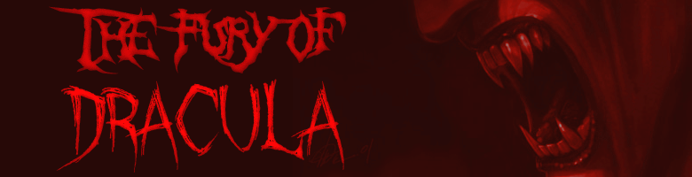
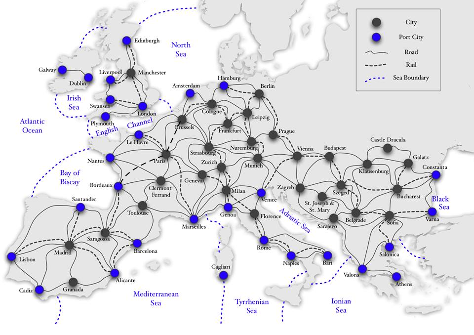
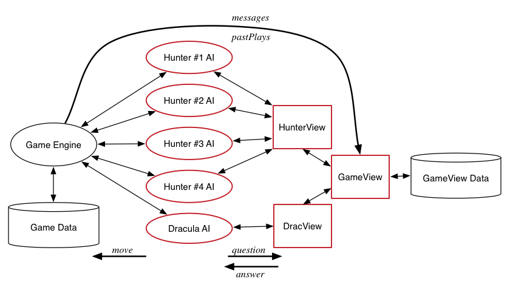

# Background

This program is a modified version of a real board game called "[The Fury of Dracula](https://en.wikipedia.org/wiki/The_Fury_of_Dracula)," where the original rules have been simplified in the making of the interface. It was created with two main implementations. "The View" is the interface of the game, in which it updates the game state with every character turn. "The Hunt" is where the AI strategy is implemented.

As such, the ultimate goal was to write AIs that can play The fury of Dracula. The interface for the AIs is very simple: the game engine invokes the AI, waits for a certain amount of time while the AI thinks about its move (possibly suggesting several moves), and then takes the last move suggested by the AI. The AIs clearly need to know about the game state in order to decide on a move. Their access to the game state is via an appropriate View abstract data type (ADT): hunters use the *HunterView* ADT, while Dracula uses the *DraculaView* ADT. Both of these ADTs are layered on top of a generic *GameView* ADT. These ADTs are are implemented within "The View."

# Introduction to the game

The game involves the arch-vampire Dracula, four intrepid vampire hunters and the splendid cities of Victorian Europe. The aim for Dracula is to evade the hunters for long enough to realise his Grand Plan - to release hordes of vampires all over Europe, while the aim for the hunters is to kill Dracula before he can do so.

# How the game works

## A short overview

Dracula and the hunters move around the cities and seas of Europe. Every time a hunter moves into the same city as Dracula and survives his traps, they have an *encounter* and Dracula loses some blood.

Dracula knows where the hunters are, but the hunters do not know where Dracula is. But he does leave clues… for if a hunter enters a city where Dracula has been in any of the last 6 rounds, the hunter discovers traces of his passing and can deduce precisely when he was there. For this reason, Dracula’s last 6 moves are called his *trail*.

The hunters work as a team, spreading out and hunting for Dracula. At the start of the game they have a score of 366 points, and for each round that passes the score slowly diminishes. The hunters need to kill Dracula before their score is reduced to an embarrassingly small number.

### More details

Dracula’s primary goal is to evade the hunters, and thus avoid being staked. However, Dracula also leaves behind nasty surprises (*traps* and *immature vampires*) in every city he visits.

Traps are slightly harmful things like wolves, or mysterious sugar bowls, or sinister pot plants. When a hunter encounters a trap, the hunter loses 2 life points.

On the first round and every 13 rounds after that, if Dracula is in a city, he leaves behind a new immature vampire, instead of a trap. After 6 rounds the vampire *matures*; it wakes up and flies away to wreak havoc, and the game score is reduced by 13 points. However, if any hunter can get to the city where the vampire is sleeping before it matures, they can stake it (and make the world a nicer place to live).

If a hunter loses all their life points, they are magically transported to the Hospital at St Joseph and St Mary, and the game score is reduced by 6 points. At the start of their next turn they are restored to full health. On the other hand, if Dracula loses all *his* blood, he is vanquished and the game is over.

Hunters can move by road, rail, or sea. Dracula can only move by road or sea; he hates trains. He isn’t all that keen on moving by water either, and every turn he spends at sea costs him 2 blood points.

Moving by road means moving from a city to another city via a single road segment. Moving by rail is less reliable - sometimes hunters can move along 3 rail segments at a time, sometimes just 1 or 2, and sometimes not at all!

Moving by sea is neat; you can rapidly travel a long way. Unfortunately, hunters can never encounter Dracula while they are at sea. Even if a hunter is in the same sea as Dracula, the two always pass each other unknowingly, like ships in the night. Furthermore, hunters are not able to discover whether the sea they are passing through is in Dracula’s trail or not. To balance this, hunters always know whether Dracula is in a city or at sea.

## The Map

# The Data

The game engine passes the game history to the View's ADT which process it, build a game state, and then makes part of the game state available to the AIs (i.e. gives a 'view' of the game to the AI). 

